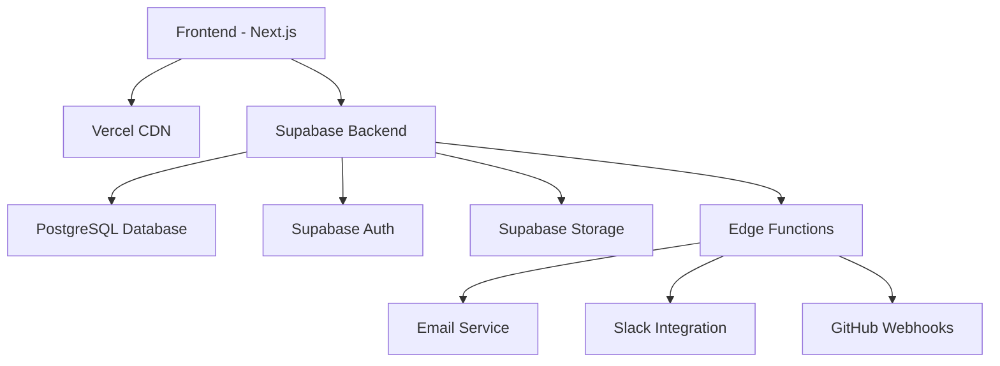

# Axon - المخطط التقني والهندسي النهائي
## System Architecture & Technical Blueprint

---

## جدول المحتويات
- [نظرة عامة على النظام](#نظرة-عامة-على-النظام)
- [هندسة النظام](#هندسة-النظام)
- [واجهة برمجة التطبيقات (API)](#واجهة-برمجة-التطبيقات-api)
- [نماذج البيانات](#نماذج-البيانات)
- [تصميم الوحدات](#تصميم-الوحدات)
- [نظام التصميم](#نظام-التصميم)
- [الأمان والأدوار](#الأمان-والأدوار)
- [الملخص التنفيذي](#الملخص-التنفيذي)

---

## نظرة عامة على النظام

### المفهوم الأساسي
**Axon** هو تطبيق ويب حديث يستخدم نموذج Backend-as-a-Service (BaaS) لتسريع تطوير MVP، مع التركيز على البساطة والأداء والزخم.

### المبادئ التصميمية
- **البساطة الجذرية:** واجهة مستخدم بسيطة، ميزات أساسية فقط
- **السرعة:** استجابة فورية، تحديثات في الوقت الفعلي
- **الزخم المدمج:** تحفيز مستمر، احتفال بالتقدم
- **التركيز المفرد:** فريق واحد، مشروع واحد

---

## هندسة النظام

### المكونات الرئيسية



### التفاصيل التقنية

#### Frontend (Next.js 14)
- **التقنية:** Next.js مع App Router
- **الاستضافة:** Vercel
- **اللغة:** TypeScript
- **التصميم:** Tailwind CSS
- **إدارة الحالة:** SWR للبيانات، React Context للمحلي

#### Backend (Supabase)
- **قاعدة البيانات:** PostgreSQL
- **المصادقة:** Supabase Auth (OAuth + Magic Links)
- **التخزين:** Supabase Storage للملفات
- **الوظائف:** Supabase Edge Functions (Deno)
- **الأمان:** Row Level Security (RLS)

#### التكاملات الخارجية
- **البريد الإلكتروني:** Resend أو Postmark
- **Slack:** Webhooks للإشعارات
- **GitHub:** Webhooks لإنشاء المهام

---

## واجهة برمجة التطبيقات (API)

### RESTful Endpoints

| Endpoint | Method | Description | Request Body | Response |
|----------|--------|-------------|--------------|----------|
| `/api/tasks` | POST | إنشاء مهمة جديدة | `{title, description, projectId, assigneeId?}` | `{id, title, status, createdAt}` |
| `/api/tasks/{id}` | PUT | تحديث مهمة | `{status?, assigneeId?, title?}` | `{id, title, status, updatedAt}` |
| `/api/tasks/{id}` | DELETE | حذف مهمة | - | `{success: true}` |
| `/api/goals` | POST | تعيين الهدف الأسبوعي | `{objective, startDate, endDate}` | `{id, objective, isCurrent}` |
| `/api/goals/current` | GET | الحصول على الهدف الحالي | - | `{id, objective, startDate, endDate}` |
| `/api/progress` | POST | نشر انتصار يومي | `{content}` | `{id, content, authorId, createdAt}` |
| `/api/progress` | GET | الحصول على انتصارات الفريق | - | `[{id, content, author, createdAt}]` |
| `/api/knowledge/search` | GET | البحث في مركز المعرفة | `?q=searchTerm` | `[{id, title, content, type}]` |
| `/api/north-star` | GET | الحصول على نجم الشمال | - | `{id, statement, metric}` |
| `/api/north-star` | PUT | تحديث نجم الشمال | `{statement, metric?}` | `{id, statement, metric}` |

### أمثلة على الطلبات

#### إنشاء مهمة جديدة
```bash
curl -X POST https://axon-app.vercel.app/api/tasks \
  -H "Content-Type: application/json" \
  -H "Authorization: Bearer <token>" \
  -d '{
    "title": "تصميم واجهة تسجيل الدخول",
    "description": "إنشاء تصميم UI/UX لصفحة تسجيل الدخول",
    "projectId": "proj-123",
    "assigneeId": "user-456"
  }'
```

#### تحديث حالة المهمة
```bash
curl -X PUT https://axon-app.vercel.app/api/tasks/task-789 \
  -H "Content-Type: application/json" \
  -H "Authorization: Bearer <token>" \
  -d '{
    "status": "DONE"
  }'
```

#### نشر انتصار يومي
```bash
curl -X POST https://axon-app.vercel.app/api/progress \
  -H "Content-Type: application/json" \
  -H "Authorization: Bearer <token>" \
  -d '{
    "content": "أكملت تصميم نظام المصادقة بنجاح!"
  }'
```

---

## نماذج البيانات

### Prisma Schema

```prisma
// schema.prisma
generator client {
  provider = "prisma-client-js"
}

datasource db {
  provider = "postgresql"
  url      = env("DATABASE_URL")
}

enum TaskStatus {
  TODO
  IN_PROGRESS
  FOR_REVIEW
  DONE
}

model User {
  id            String    @id @default(uuid())
  email         String    @unique
  name          String?
  avatarUrl     String?   @map("avatar_url")
  createdAt     DateTime  @default(now()) @map("created_at")
  updatedAt     DateTime  @updatedAt @map("updated_at")
  
  teamId        String?   @map("team_id")
  team          Team?     @relation(fields: [teamId], references: [id])
  assignedTasks Task[]    @relation("AssigneeTasks")
  progressEntries ProgressEntry[]
  
  @@map("users")
}

model Team {
  id        String    @id @default(uuid())
  name      String
  createdAt DateTime  @default(now()) @map("created_at")
  updatedAt DateTime  @updatedAt @map("updated_at")
  
  members   User[]
  project   Project?
  
  @@map("teams")
}

model Project {
  id          String      @id @default(uuid())
  name        String      @default("Axon Project")
  teamId      String      @unique @map("team_id")
  team        Team        @relation(fields: [teamId], references: [id])
  createdAt   DateTime    @default(now()) @map("created_at")
  
  northStar   NorthStar?
  goals       Goal[]
  tasks       Task[]
  milestones  Milestone[]
  knowledge   Knowledge[]
  
  @@map("projects")
}

model NorthStar {
  id          String   @id @default(uuid())
  statement   String
  metric      String?
  projectId   String   @unique @map("project_id")
  project     Project  @relation(fields: [projectId], references: [id])
  createdAt   DateTime @default(now()) @map("created_at")
  
  @@map("north_stars")
}

model Goal {
  id          String   @id @default(uuid())
  objective   String
  startDate   DateTime @map("start_date")
  endDate     DateTime @map("end_date")
  isCurrent   Boolean  @default(true) @map("is_current")
  projectId   String   @map("project_id")
  project     Project  @relation(fields: [projectId], references: [id])
  createdAt   DateTime @default(now()) @map("created_at")
  
  @@map("goals")
}

model Task {
  id           String      @id @default(uuid())
  title        String
  description  String?
  status       TaskStatus  @default(TODO)
  projectId    String      @map("project_id")
  project      Project     @relation(fields: [projectId], references: [id])
  assigneeId   String?     @map("assignee_id")
  assignee     User?       @relation("AssigneeTasks", fields: [assigneeId], references: [id])
  createdAt    DateTime    @default(now()) @map("created_at")
  updatedAt    DateTime    @updatedAt @map("updated_at")
  
  history      ActivityLog[]
  
  @@map("tasks")
}

model ActivityLog {
  id        String   @id @default(uuid())
  taskId    String   @map("task_id")
  task      Task     @relation(fields: [taskId], references: [id])
  change    String   // e.g., "status changed from TODO to IN_PROGRESS"
  userId    String   @map("user_id")
  createdAt DateTime @default(now()) @map("created_at")
  
  @@map("activity_logs")
}

model Milestone {
  id            String   @id @default(uuid())
  title         String
  description   String?
  achievedAt    DateTime? @map("achieved_at")
  isAchieved    Boolean   @default(false) @map("is_achieved")
  projectId     String   @map("project_id")
  project       Project  @relation(fields: [projectId], references: [id])
  
  @@map("milestones")
}

model ProgressEntry {
  id        String   @id @default(uuid())
  content   String   // The "daily win" text
  authorId  String   @map("author_id")
  author    User     @relation(fields: [authorId], references: [id])
  projectId String   @map("project_id")
  project   Project  @relation(fields: [projectId], references: [id])
  createdAt DateTime @default(now()) @map("created_at")
  
  @@map("progress_entries")
}

model Knowledge {
  id        String   @id @default(uuid())
  type      String   // "DOCUMENT", "FILE", "MEETING_NOTES"
  title     String
  content   String?  // For documents/notes
  fileUrl   String?  @map("file_url") // For files in Supabase Storage
  projectId String   @map("project_id")
  project   Project  @relation(fields: [projectId], references: [id])
  createdAt DateTime @default(now()) @map("created_at")
  
  @@map("knowledge")
}
```

### JSON Schema Examples

#### Task Schema
```json
{
  "$schema": "http://json-schema.org/draft-07/schema#",
  "title": "Task",
  "type": "object",
  "properties": {
    "id": { "type": "string", "format": "uuid" },
    "title": { "type": "string", "minLength": 1 },
    "description": { "type": "string" },
    "status": { "enum": ["TODO", "IN_PROGRESS", "FOR_REVIEW", "DONE"] },
    "projectId": { "type": "string", "format": "uuid" },
    "assigneeId": { "type": ["string", "null"], "format": "uuid" },
    "createdAt": { "type": "string", "format": "date-time" },
    "updatedAt": { "type": "string", "format": "date-time" }
  },
  "required": ["id", "title", "status", "projectId", "createdAt", "updatedAt"]
}
```

#### NorthStar Schema
```json
{
  "$schema": "http://json-schema.org/draft-07/schema#",
  "title": "NorthStar",
  "type": "object",
  "properties": {
    "id": { "type": "string", "format": "uuid" },
    "statement": { "type": "string" },
    "metric": { "type": "string" },
    "projectId": { "type": "string", "format": "uuid" },
    "createdAt": { "type": "string", "format": "date-time" }
  },
  "required": ["id", "statement", "projectId", "createdAt"]
}
```

---

## تصميم الوحدات

### 1. لوحة التحكم الرئيسية (Dashboard)

#### الغرض
تقديم نظرة فورية وشخصية لحالة المشروع وأولويات المستخدم لليوم.

#### الميزات الأساسية
- عرض نجم الشمال للمشروع
- الهدف الأسبوعي الحالي
- مهام المستخدم المخصصة
- جدار التقدم (Progress Wall)

#### التصميم النصي (Wireframe)

```
+----------------------------------------------------------------------+
| [Header: Axon Project]              [User Avatar] [Notifications]    |
+----------------------------------------------------------------------+
| [NORTH STAR: Celebrate 10,000 "Done" tasks...]                       |
+----------------------------------------------------------------------+
| [THIS WEEK'S GOAL: Launch landing page and get 50 signups.]          |
+----------------------------------------------------------------------+
| [MY TASKS FOR TODAY]                  | [PROGRESS WALL]              |
| +-----------------------------------+ | +--------------------------+ |
| | [ ] Task 1: Design login modal    | | | [Avatar] Sarah just...   | |
| | [ ] Task 2: Setup DB schema       | | | [Avatar] Ahmed just...   | |
| | [ ] Task 3: Fix auth bug          | | | [Avatar] You just...     | |
| | [+ Add Task]                      | | | [Post a Win...]          | |
| +-----------------------------------+ | +--------------------------+ |
+----------------------------------------------------------------------+
```

#### User Flow: Morning Check-in
1. المستخدم يفتح التطبيق
2. Frontend يطلب `/api/dashboard`
3. Backend يجمع البيانات: North Star, Goal, مهام المستخدم, Progress Entries
4. لوحة التحكم تعرض الوضوح الفوري على الهدف الرئيسي والمساهمة الشخصية

### 2. لوحة المهام (Kanban Board)

#### الغرض
أن تكون المصدر الوحيد للحقيقة لجميع الأعمال قيد التقدم.

#### الميزات الأساسية
- أعمدة: To Do, In Progress, For Review, Done
- بطاقات مهام قابلة للسحب
- تعيين المهام
- تفاصيل المهام

#### التصميم النصي (Wireframe)

```
+----------------------------------------------------------------------+
| [Board View Controls: Filter by User]        [+ New Task]            |
+----------------------------------------------------------------------+
| [TO DO (5)]  | [IN PROGRESS (2)] | [FOR REVIEW (1)] | [DONE (23)]   |
| +----------+ | +---------------+ | +--------------+ | +-----------+ |
| | Task A   | | | Task F        | | | Task H       | | | Task Z    | |
| | [Avatar] | | | [Avatar]      | | | [Avatar]     | | | [Avatar]  | |
| +----------+ | +---------------+ | +--------------+ | +-----------+ |
| | Task B   | | | Task G        | |                | |             | |
| | [Avatar] | | | [Avatar]      | |                | |             | |
| +----------+ | +---------------+ |                | |             | |
| ...        |                     |                |               |
+----------------------------------------------------------------------+
```

#### User Flow: إكمال مهمة
1. المستخدم يسحب بطاقة مهمة من "For Review" إلى "Done"
2. `onDragEnd` event يحدث في Frontend
3. Frontend يطلب API: `PUT /api/tasks/task-123` مع `{ status: "DONE" }`
4. UI يظهر المهمة في عمود "Done" مع تأثير confetti
5. Backend يحدث حالة المهمة، ينشئ ActivityLog، وينشئ ProgressEntry

### 3. مركز المعرفة (Knowledge Hub)

#### الغرض
أن يكون الذاكرة طويلة المدى للمشروع.

#### الميزات الأساسية
- محرر مستندات بسيط
- رفع الملفات
- قسم الملاحظات
- بحث قوي

#### التصميم النصي (Wireframe)

```
+----------------------------------------------------------------------+
| [Search Knowledge Hub...]                                            |
+----------------------------------------------------------------------+
| [NAVIGATION]     | [CONTENT AREA]                                    |
| +--------------+ | +-----------------------------------------------+ |
| | Project Brief| | | # Project Brief                               | |
| | Design Files | | |                                               | |
| | Meeting Notes| | | ## The Problem                                | |
| | [+ New Doc]  | | | We are solving...                             | |
| +--------------+ | +-----------------------------------------------+ |
+----------------------------------------------------------------------+
```

#### البحث
- استخدام PostgreSQL full-text search
- البحث في المحتوى وأسماء الملفات
- فهرسة تلقائية للمحتوى الجديد

### 4. نظام الزخم (Momentum System)

#### الغرض
جعل التقدم مرئياً ومحتفى به ومستمراً.

#### الميزات الأساسية
- قناة الانتصارات اليومية
- لافتات احتفال المعالم
- ملخصات أسبوعية

#### User Flow: نشر انتصار يومي
1. المستخدم ينقر "Post a Win..." في لوحة التحكم
2. نافذة بسيطة تفتح مع حقل نص: "ما الذي أنجزته اليوم؟"
3. المستخدم يكتب "أكملت إعادة هيكلة API لتكون أسرع 50%!" ويرسل
4. Frontend يطلب: `POST /api/progress` مع `{ content: "..." }`
5. Backend ينشئ ProgressEntry
6. الانتصار الجديد يظهر فوراً في أعلى جدار التقدم

---

## نظام التصميم

### Design Tokens

```javascript
// tailwind.config.js
const colors = require('tailwindcss/colors')

module.exports = {
  theme: {
    colors: {
      transparent: 'transparent',
      current: 'currentColor',
      black: colors.black,
      white: colors.white,
      gray: colors.zinc,
      primary: colors.indigo,
      success: colors.emerald,
      warning: colors.amber,
      danger: colors.red,
    },
    spacing: {
      '0': '0', '1': '4px', '2': '8px', '3': '12px', 
      '4': '16px', '5': '20px', '6': '24px', '8': '32px', 
      '10': '40px', '12': '48px', '16': '64px',
    },
    fontFamily: {
      sans: ['Inter', 'sans-serif'],
    },
  },
}
```

### UI Language & Micro-interactions

#### الأسلوب
- بسيط، عالي التباين، مع مساحات بيضاء واسعة
- البطاقات لها ظلال خفيفة وتحويل scale خفيف عند hover

#### تأثير الاحتفال (Confetti Animation)
```css
@keyframes confetti-rain {
  0% { transform: translateY(-100%); opacity: 1; }
  100% { transform: translateY(100vh); opacity: 0; }
}

.confetti {
  position: absolute;
  width: 8px;
  height: 12px;
  background-color: var(--color-primary-500);
  animation: confetti-rain 3s linear infinite;
}
```

---

## الأمان والأدوار

### مصفوفة الأدوار

| الدور | الصلاحيات | الوصف |
|-------|-----------|--------|
| **Owner** | تحكم كامل | إدارة الفريق والمشروع |
| **Admin** | إدارة المشاريع والأعضاء | إضافة/حذف الأعضاء، إدارة المشاريع |
| **Editor** | إنشاء/تحديث المهام والمنشورات | إدارة المهام، نشر الانتصارات |
| **Commenter** | إنشاء التعليقات والملاحظات | التفاعل مع المحتوى |
| **Viewer** | قراءة فقط | عرض المحتوى دون تعديل |

### Supabase RLS Examples

```sql
-- السماح بالقراءة للمهام فقط لأعضاء الفريق
CREATE POLICY "select_task_if_member" ON public.tasks
  FOR SELECT USING (
    EXISTS (
      SELECT 1 FROM public.teams t
      JOIN public.users u ON u.team_id = t.id
      WHERE t.id = (SELECT team_id FROM public.projects p WHERE p.id = tasks.project_id)
        AND u.id = auth.uid()
    )
  );

-- السماح بإنشاء المهام للمحررين وأعلى
CREATE POLICY "insert_task_if_editor" ON public.tasks
  FOR INSERT WITH CHECK (
    EXISTS (
      SELECT 1 FROM public.teams t
      JOIN public.users u ON u.team_id = t.id
      WHERE t.id = (SELECT team_id FROM public.projects p WHERE p.id = tasks.project_id)
        AND u.id = auth.uid()
        AND u.role IN ('owner', 'admin', 'editor')
    )
  );
```

---

## الملخص التنفيذي

### ما تم إنجازه
✅ هندسة نظام شاملة مع Next.js + Supabase  
✅ واجهة API مفصلة مع أمثلة curl  
✅ نماذج بيانات Prisma كاملة  
✅ تصاميم وحدات الأربع مع wireframes نصية  
✅ نظام تصميم مع design tokens  
✅ أمان متقدم مع RLS policies  

### التقنيات المختارة
- **Frontend:** Next.js 14, TypeScript, Tailwind CSS
- **Backend:** Supabase (PostgreSQL, Auth, Storage, Edge Functions)
- **Hosting:** Vercel للفرونت إند، Supabase للباك إند
- **التكاملات:** Resend للبريد، Slack للتنبيهات، GitHub للويب هوكس

### نقاط القرار الأساسية
1. **Backend-as-a-Service:** تسريع التطوير مع Supabase
2. **App Router:** أحدث ميزات Next.js للتصميم المعياري
3. **Row Level Security:** أمان متقدم على مستوى قاعدة البيانات
4. **Real-time Updates:** تحديثات فورية عبر Supabase subscriptions

### قياسات النجاح المقترحة (KPIs)
- **الاستخدام اليومي:** عدد المستخدمين النشطين يومياً
- **إنتاجية الفريق:** عدد المهام المكتملة أسبوعياً
- **معدل الاحتفاظ:** نسبة المستخدمين الذين يعودون بعد أسبوع
- **رضا المستخدم:** تقييمات من 1-5 للبساطة والفائدة

---

## قائمة التحقق النهائية

- [x] مخطط بنية نظامي نصي
- [x] واجهة API مفصلة مع أمثلة
- [x] نماذج بيانات كاملة (Prisma + JSON)
- [x] تصاميم الوحدات الأربع مع wireframes
- [x] user flows مفصلة لكل عملية
- [x] نظام تصميم مع design tokens
- [x] أمان متقدم مع RLS policies
- [x] ملخص تنفيذي مع KPIs

---

**English Summary:** This technical blueprint establishes Axon's complete system architecture using Next.js 14 + Supabase, featuring comprehensive API design, Prisma data models, and detailed component wireframes for all four core modules (Dashboard, Kanban, Knowledge Hub, Momentum System). The architecture emphasizes radical simplicity, real-time updates, and integrated momentum mechanics while maintaining enterprise-grade security through Supabase RLS policies.
